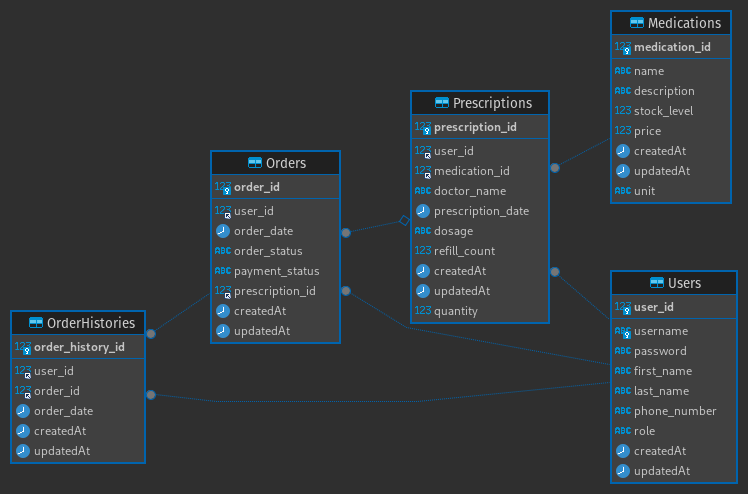

Utibu Health Backend
====================

This repository contains the source code for the Utibu Health backend, a remote medication ordering system for patients
with chronic conditions. The backend is built using Node.js, Express, and Sequelize and interacts with a Microsoft SQL
Server database using the `mssql2` package.

Getting Started
---------------

1. Clone the backend repository: git clone https://github.com/murageh/utibu_health_backend.git`
2. Navigate to the backend directory: `cd utibu-health/backend` _(be sure to replace the folder
   name)_
3. Install the dependencies: `npm install`
4. Set up the database by creating an environment file `.env` file with your Microsoft SQL Server
   credentials. There is an `.env.example` file that you can use as a template.
5. Run the backend server: `npm start`

API Documentation
-----------------

The API documentation is generated using Swagger and can be accessed at `http://localhost:3000/api-docs`.

Database Schema
---------------

The database schema is defined in the `models` directory. The following tables are used:

- `Users`
- `Prescriptions`
- `Medications`
- `Orders`
- `OrderHistory*`

License
-------

[MIT](https://choosealicense.com/licenses/mit/)